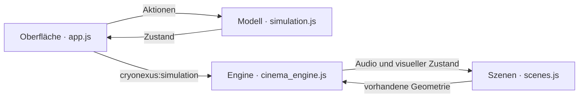

# CRYONEXUS · Lunar Eclipse

**Du bist Zeitzeuge. Nicht Zuschauer.**

Eine deutschsprachige, prozedurale 3D-Erfahrung zwischen Eis, Finsternis und Schattenmarkt. Sechs Szenen teilen sich ein deterministisches Simulationsmodell: Deine Käufe, Bindungen und Phasenwechsel verändern Zahlen, Vault-Zugang und die sichtbare Welt.

**[App öffnen](https://pierreg99.github.io/CryoNexis-Lunar-Eclispe/) · [Lokal starten](#in-einer-minute-starten) · [Handbuch / Wiki](docs/wiki/Home.md) · [Architektur](docs/wiki/Architektur.md) · [Prüfbericht](VERIFICATION.md)**

| Erlebnis | Architektur | Auslieferung | Prüfung |
| --- | --- | --- | --- |
| 6 prozedurale Szenen | 4 getrennte Schichten | 754.345 Bytes in `dist/` | 10 Modell- und 4 Terminal-Testgruppen; gezielte Browserprüfungen bestanden |

## In einer Minute starten

```sh
git clone --branch main https://github.com/Pierreg99/CryoNexis-Lunar-Eclispe.git
cd CryoNexis-Lunar-Eclispe
python3 -m http.server 8080 --directory dist
```

Öffne **http://localhost:8080**. Die auslieferbare App braucht keinen Build und keine Installation. Three.js, Shader, Schriftarten und Audio bleiben lokal; es gibt keine kostenpflichtige API oder Server-Datenbank. `dist/index.html` lässt sich in Browsern öffnen, die `file://` erlauben. Bei gesperrten Datei-URLs funktioniert der lokale Server.

## Was du verändern kannst

| Deine Handlung | Berechnete Folge | Sichtbare Reaktion |
| --- | --- | --- |
| Knoten kaufen oder verkaufen | Bestand, Vermögen, Gebühren und Slippage ändern sich | Das Kristallfeld reagiert auf deine Positionen |
| Knoten zeitlich binden | Stärke und Liquidität steigen; 1.200 CNX werden verbraucht | Die zugehörigen Nexus-Schollen rücken zusammen |
| Netzwerk stabilisieren | Bis zu +8 Stärke und +7 Kohärenz für 700 CNX | Die Kammer und der gemeinsame Puls reagieren |
| Phase wählen | Marktbedingungen ändern sich; manuelle Wechsel kosten Kohärenz | Mondstellung, Korona und Diamantring folgen der Phase |
| Vault öffnen und befüllen | Einlagen verdienen im offenen Zeitfenster simulierte Zinsen | Würfelgitter öffnen sich, der Kern gewinnt an Leistung |

Du startest mit **100.000 fiktiven CNX**. Drei Bindungen, Stabilität ≥75 und Kohärenz ≥35 öffnen den Vault während **Korona** oder **Freisteller**. Deine Zeitspuren und die Zufallsfolge werden lokal gespeichert. Alle Werte folgen dokumentierten Spielregeln; sie sind keine realen Markt- oder Astronomiedaten.

**[Ersten Vault öffnen →](docs/wiki/Schnellstart.md#dein-erster-vault) · [Alle Regeln und Zahlen →](docs/wiki/Simulation.md)**

Das Terminal liefert konkrete Ergebnisbelege mit Gebühren, Geldfluss und Beständen. `help buy` erklärt einen einzelnen Befehl; `tasks` zeigt sechs aktuelle Aufgaben mit nächsten Schritten. [Alle Befehle und Ergebnisse →](docs/wiki/Terminal.md)

## Die sechs Welten

| Kammer | Finsternis | Eis-Nexus |
| --- | --- | --- |
| Kristallgitter, Frost und schwebende Partikel | Prozeduraler Mond, Korona und Plasmabögen | 46 Schollen mit eigenen Umlaufbahnen |

| Schattenmarkt | Vault | Jenseits der Zeit |
| --- | --- | --- |
| 130 Kristalle, sechs Knoten und echte Spielentscheidungen | Terminal, Datensäulen und bedingter Zugang | Nebel, Staub und steuerbare Zeitlinie |

Bloom, ACES, Filmkorn, Scanlines, Vignette und chromatische Aberration verbinden die Szenen. Klang entsteht nach einer Benutzeraktion lokal. „Bewegung reduzieren“ stoppt automatische Animationen und Simulationszeit; Handel, Terminal und manuelle Schritte bleiben nutzbar.

## Vier Schichten, klare Zuständigkeiten



Die Oberfläche enthält keine 3D-Geometrie. Das Modell kennt weder DOM noch Speicher. Die Engine besitzt höchstens zwei WebGL-Kontexte und rendert ausschließlich sichtbare Szenen. GPU-Daten ausgeblendeter Szenen und große Puffer freier Slots werden freigegeben; CPU-Szenen bleiben gecacht. Viertelauflösender Bloom verwendet zwei permanente Targets ohne Allokationen pro Frame. Die Oberfläche startet mit 89.514 Bytes JavaScript; Three.js und Szenen (632.861 Bytes) laden nach dem ersten UI-Paint nach. Die frühere künstliche 2,4-Sekunden-Boot-Sequenz entfällt. Bei reduzierter Bewegung werden die Grafikskripte erst nach Aktivierung der Bewegung geladen. Alle Skripte laden klassisch und lokal, ohne Bundler oder ES-Modulimporte.

**[Modulverträge →](docs/wiki/Architektur.md) · [Szenen und Shader →](docs/wiki/Szenen.md) · [Farben und Gestaltung →](docs/wiki/Designsystem.md)**

## Prüfen und weiterentwickeln

```sh
npm ci
npx playwright install chromium
npm test
```

Nur das Modell prüfen: `npm run test:simulation`. Diese Werkzeuge sind Entwicklungsabhängigkeiten; `dist/` benötigt sie nicht.

Die Terminal-Erweiterung besteht zusätzlich vier reine Terminal-Testgruppen sowie Browserprüfungen für alle Befehle, Simulation, verzögerten Grafikstart und mobile Ergebnisse. Der vorherige vollständige Testlauf bestand zehn Modell-Testgruppen und zehn HTTP-Browserdurchläufe einschließlich nativer GPU-Ressourcenprüfung bei DPR 2. Zwei `file://`-Versuche wurden durch die verwaltete Browserrichtlinie blockiert. **60 FPS und der gesamte VRAM auf echter Hardware sind noch nicht nachgewiesen.** Die konservative Target-Schätzung ist auf 24,7 MB für beide Renderer-Slots begrenzt. Details, Testauswahl und Messgrenzen stehen im [Prüfbericht](VERIFICATION.md) und im [Test-Handbuch](docs/wiki/Tests-und-Qualitaet.md).

## Dokumentation und Hosting

Das [Handbuch](docs/wiki/Home.md) führt vom ersten Vault bis zu Formeln, Modulverträgen und Veröffentlichung. Seine Markdown-Seiten liegen versioniert in `docs/wiki/`; Sidebar und Footer sind für das GitHub-Wiki vorbereitet. Das Wiki ist auf GitHub aktiviert, sein separates Git-Repository ist noch nicht initialisiert. Das [Veröffentlichungsskript](scripts/publish-wiki.py) exportiert und synchronisiert die Seiten, sobald eine erste Wiki-Seite angelegt wurde.

Die vollständige App ist auf **[GitHub Pages](https://pierreg99.github.io/CryoNexis-Lunar-Eclispe/)** veröffentlicht. Der [Pages-Workflow](.github/workflows/pages.yml) liefert alle neun Laufzeitdateien unverändert aus `main/dist/` aus. Änderungen an der App auf `main` werden automatisch veröffentlicht; eine manuelle Veröffentlichung ist über „Run workflow“ möglich. GitHub Pages ist für öffentliche Repositories innerhalb der geltenden GitHub-Limits kostenlos; die App benötigt keine zusätzlichen Dienste. [Hosting und Wiki veröffentlichen →](docs/wiki/Hosting-und-Wiki.md)

Three.js r149 ist lokal enthalten und unter MIT lizenziert: [Lizenz](dist/assets/vendor/THREE-LICENSE.txt). Für den eigenen Projektcode ist bislang keine separate Lizenz festgelegt.
