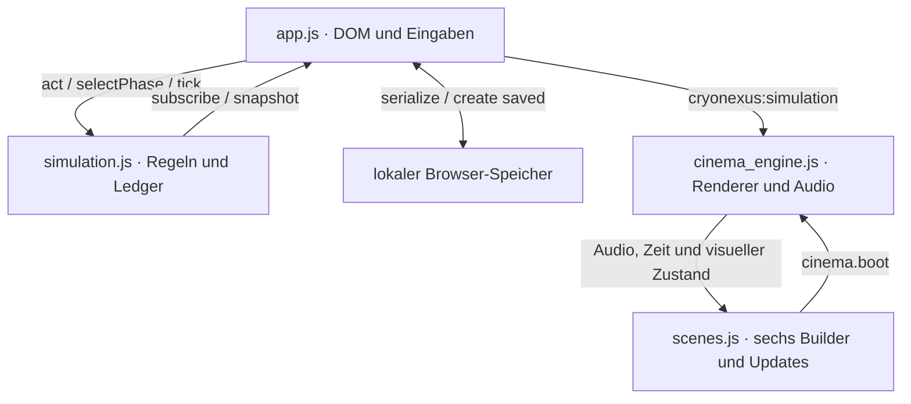

# Architektur und Modulverträge

**[Handbuch](Home.md) / Entwicklung**

Vier Laufzeitschichten besitzen getrennte Zuständigkeiten. Marktrechnungen finden ausschließlich im Modell statt; sichtbare Effekte lesen dessen abgeleiteten Zustand.



## Dateien und Eigentum

| Datei | Verantwortung | Darf nicht besitzen |
| --- | --- | --- |
| [simulation.js](../../dist/assets/js/simulation.js) | Phasenprofile, PRNG, Transaktionen, Zustand, Validierung | DOM, `localStorage`, Renderer |
| [app.js](../../dist/assets/js/app.js) | Eingaben, HUD, Terminal, Speicherung, Modell-Abonnement | Geometrie, Shader, Marktformeln |
| [scenes.js](../../dist/assets/js/scenes.js) | Sechs einmalige Builder, bestehende Materialien und Instanzen aktualisieren | Cash, Transaktionen, Renderer-Pool |
| [cinema_engine.js](../../dist/assets/vendor/cinema_engine.js) | Maximal zwei Renderer, Sichtbarkeit, Frame-Schleifen, Audio, Post-FX | Wirtschaftsentscheidungen |
| [index.html](../../dist/index.html) | Sechs semantische Sektionen und stabile IDs | Laufzeitberechnungen |
| [main.css](../../dist/assets/css/main.css) | 20 nummerierte Blöcke, Tokens, responsive Gestaltung | Modellzustand |

Die Ladefolge ist **Three.js → Cinema → Szenen → Simulation → App**. Klassische Skripte ermöglichen die lokale Dateistruktur ohne Bundler und ohne ES-Modulimporte. Das Modell exportiert zusätzlich CommonJS für seine Node-Tests.

## Modell-API

```js
const model = CryoSimulation.create({ seed: 404 });
const unsubscribe = model.subscribe(snapshot => {
  console.log(snapshot.cash, snapshot.vault.open);
});

const quote = model.quote('buy', 'CN-ALPHA-01', 2);
if (quote.ok) model.act('buy', { id: 'CN-ALPHA-01', quantity: 2 });

model.selectPhase(2, { manual: true });
model.tick({ force: true });
const saved = model.serialize();
const restored = CryoSimulation.create({ saved });
unsubscribe();
```

| Methode | Vertrag |
| --- | --- |
| `snapshot()` | Abgeleitete Kopie von Zustand, Knoten, Vault, Historie und `visual` |
| `act(type, payload)` | Führt eine gültige Aktion atomar aus; gibt `{ok, message}` zurück |
| `quote(type, id, quantity)` | Reine Kauf-/Verkaufsquote; verändert den Zustand nicht |
| `tick({force})` | Ein Fünf-Minuten-Takt; Pause sperrt gewöhnliche Takte, `force: true` erlaubt einen Schritt |
| `selectPhase(index, {manual})` | Index 0–4; manuelle Wechsel kosten Kohärenz, automatische nicht |
| `subscribe(fn)` | Ruft sofort mit einer Kopie auf und liefert eine Abmeldefunktion |
| `serialize()` | Versionierter JSON-fähiger Rohzustand inklusive PRNG |

Ungültige gespeicherte Versionen, Zahlen, IDs, Schlüssel oder Historien starten sauber neu und setzen `restoreError`. Snapshot- und Subscriber-Kopien können das Modell nicht verändern. DOM-Abonnements und Speicherausfälle bleiben Aufgabe der Oberfläche.

## Ereignisse zwischen Oberfläche und Grafik

| Ereignis | Inhalt | Empfänger |
| --- | --- | --- |
| `cryonexus:scene` | `{id, section}` nach erfolgreichem Build | HUD-Szenenzähler |
| `cryonexus:phase` | `{index, name}` | Phasendiagnose; Engine-Fallback vor erstem Modellzustand |
| `cryonexus:simulation` | Nur `snapshot.visual`, keine Transaktionsbefehle | Engine und nächste sichtbare Szenen-Updates |
| `cryonexus:graphics` | Grafik-Fallback-Meldung | Oberflächenstatus |

`visual` enthält Phase, Kohärenz/Stabilität/Flux/Korona in 0–1, Temperatur in °C, sechs Bindungen, sechs Stärken und Holdings, Vault-Zugang/Leistung sowie die Ereignissequenz. Die Engine begrenzt ihre Anzeigeeingaben. Sobald ein Modellzustand vorliegt, ist dessen Phase maßgeblich.

## Renderer und Lebenszyklus

Szenen werden innerhalb eines 250-px-Vorlaufs einmalig gebaut und bleiben gecacht. Die sechs ursprünglichen Canvas-Elemente sind Anker. Zwei gemeinsam genutzte Renderer bewegen ihre tatsächlichen Canvas-Flächen zu den sichtbaren Sektionen.

Vor jedem Draw prüft die Engine die aktuelle Bildschirmposition. Verborgene Tabs, Offscreen-Sektionen und reduzierte Bewegung erzeugen keine Renderframes. Kontextwiederherstellung ersetzt verlorene Render-Targets, erhält aber Szenen und Kontextanzahl.

Diagnose in der Browserkonsole:

```js
cinema.getStats();       // Contexts, running scenes, frames and applied visual values
CryoScenes.built();      // Successfully built canvas IDs
CryoScenes.failed();     // Failed canvas IDs
```

## Änderungen einordnen

Neue Spielregeln gehören in `simulation.js`, Eingaben in `app.js`, Geometrie in Builder und visuelle Reaktionen in `onUpdate`. Erzeuge beim Handeln keine neuen Geometrien, Materialien oder Renderer. Behalte Offline-Ressourcen, reduzierte Bewegung und die Trennung von Modell und Grafik bei.

**Weiter:** [Szenen](Szenen.md) · [Simulation](Simulation.md) · [Tests](Tests-und-Qualitaet.md)
