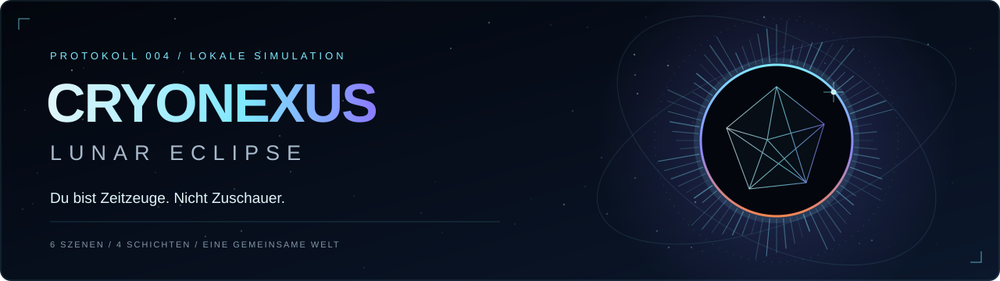

# Das CRYONEXUS-Handbuch

> Du bist Zeitzeuge. Nicht Zuschauer.

Hier wird aus einer visuellen Welt eine nachvollziehbare Simulation. Einstieg, Zahlen, Bedienung und technische Verträge greifen ineinander. Das Handbuch dokumentiert den vorhandenen Stand; die CNX und physikalischen Anzeigen folgen fiktiven Spielregeln.

| Ich möchte … | Hier beginnen |
| --- | --- |
| Die App starten und den ersten Vault öffnen | [Schnellstart](Schnellstart.md) |
| Handeln, pausieren und Fortschritt behalten | [Bedienung](Bedienung.md) |
| Die Zahlen und Phasen verstehen | [Simulation](Simulation.md) |
| Das Terminal nutzen | [Terminal](Terminal.md) |
| Den Code erweitern | [Architektur](Architektur.md) |
| Die sechs Szenen und ihre Reaktionen verstehen | [Szenen](Szenen.md) |
| Die Gestaltung fortführen | [Designsystem](Designsystem.md) |
| Qualität und Grenzen prüfen | [Tests und Qualität](Tests-und-Qualitaet.md) |
| Auf GitHub Pages hosten oder das Wiki veröffentlichen | [Hosting und Wiki](Hosting-und-Wiki.md) |
| Ein Problem lösen | [FAQ](FAQ.md) |

## Drei Wege durch das Projekt

**Erleben:** [Starten](Schnellstart.md) → [Bedienen](Bedienung.md) → [Regeln verstehen](Simulation.md).

**Entwickeln:** [Architektur](Architektur.md) → [Szenen](Szenen.md) → [Prüfen](Tests-und-Qualitaet.md).

**Gestalten und veröffentlichen:** [Designsystem](Designsystem.md) → [Hosting und Wiki](Hosting-und-Wiki.md).

## Stand und Grenzen

Vier Schichten verbinden sechs prozedurale Szenen. Neun Dateien in `dist/` belegen 754.345 Bytes. Terminal-Hilfe und Ergebnisbelege sind ein eigenes Modul; der Aufgabenstand folgt dem vorhandenen Simulationsmodell. Aktuelle Nachweise stehen im [Prüfbericht](../../VERIFICATION.md). Die App fordert keine externen Laufzeitressourcen an.

Direkte Datei-URLs sind in der Testumgebung gesperrt. Die Zielrate von 60 FPS muss auf echten Geräten geprüft werden. Der vollständige [Prüfbericht](../../VERIFICATION.md) trennt bestandene Checks von offenen Nachweisen.

Die Seiten in diesem Verzeichnis sind die versionierte Quelle des GitHub-Wikis. Das [Veröffentlichungsverfahren](Hosting-und-Wiki.md#github-wiki-veröffentlichen) erklärt die einmalige Initialisierung und die anschließende Synchronisierung.
