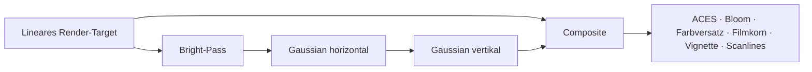

# Sechs Szenen, ein Zustand

**[Handbuch](Home.md) / Grafik**

Die Welt entsteht aus Geometrie, GLSL und lokal erzeugtem Audio. Keine Szene benötigt Bildtexturen, externe Modelle oder Video. Die Quelle liegt in [scenes.js](../../dist/assets/js/scenes.js).

| Szene / Canvas | Prozedurale Elemente | Reaktion auf Entscheidungen |
| --- | --- | --- |
| Kammer · `cn-chamber` | Icosahedron-Schale, Kristallgitter, Käfig, 6.000 Frostpartikel | Kohärenz und Stabilität verändern Kristallintensität, Kanten und Kameradrift; Temperatur verändert Frost |
| Finsternis · `cn-eclipse` | Mond mit Kraterrauschen, Korona, Diamantring, fünf Plasmabögen, 900 Funken | Phase bestimmt Mondversatz und Diamantbetonung; Korona und Flux steuern Licht und Funken |
| Eis-Nexus · `cn-nexus` | Eis-Torus, Kern, 46 Schollen, 90 Partikel | Gebundene Sektoren ziehen ihre Schollen zusammen; Stärke und Holdings verändern Größe und gemeinsamen Puls |
| Schattenmarkt · `cn-crystal` | 130 instanzierte Kristalle, prozedurales Bodengitter | Sechs Sektorgruppen lesen jeweilige Stärke, Bindung und Positionsgewicht |
| Vault · `cn-vault` | Drei Würfelgitter, 70 Datensäulen, kalter Kern | Offenes Gate trennt Gitter; Einlagen erhöhen Kernleistung und Säulenaktivität |
| Jenseits der Zeit · `cn-void` | Nebel-Schale, 5.000 Staubpartikel | Kohärenz und Ereignissequenz verändern Nebel und Echo-Bänder |

## Gemeinsame Materialsprache

Eis nutzt Fraktalrauschen, Adern, Randlicht und einen Frostparameter. Kristallinstanzen tragen Sektor-Signal und Sektor-Stake als Attribute. Additive Linien, Partikel und Lichtflächen schreiben nicht in den Tiefenpuffer. Szenen-Updates verändern vorhandene Ressourcen; Geometriezahlen bleiben konstant.

## Post-FX

Der Renderer verwendet `NoToneMapping`; ACES gehört in den Composite. Render-Targets verwenden Half-Float, wenn unterstützt, sonst einen kompatiblen 8-Bit-Pfad. Radiale chromatische Aberration bleibt im Bildzentrum null. Die Engine begrenzt Auflösung und reduziert bei dauerhaft langen Frames die Render-Skalierung.

## Audio-Reaktion

Ein `AnalyserNode` liefert normalisierte Bass-, Mitten- und Höhenbänder. Der lokale Drone startet nach Benutzeraktivierung. Ohne aktiven Klang liefert ein Sinus-Drift weiterhin sanfte Werte. Das Kristallfeld liest Mitten, der Nexus Bass und Höhen; ähnliche Bänder modulieren die anderen Szenen.

Bei reduzierter Bewegung werden Canvas und automatische Frames deaktiviert. Die identischen Simulationsentscheidungen bleiben in den 2D-Anzeigen nachvollziehbar.

**Weiter:** [Designsystem](Designsystem.md) · [Architektur](Architektur.md) · [Qualität](Tests-und-Qualitaet.md)
